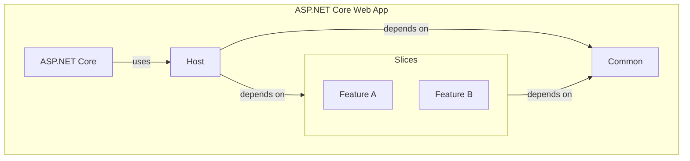

[](https://github.com/SSWConsulting/VerticalSliceArchitecture)

# 🤔 What is it?

An enterprise ready solution template for Vertical Slice Architecture.
This template is just one way to apply the Vertical Slice Architecture.

Read more on [SSW Rules to Better Vertical Slice Architecture](https://www.ssw.com.au/rules/rules-to-better-vertical-slice-architecture/)

## Learn

[](https://www.youtube.com/watch?v=T-EwN9UqRwE) [](http://lukeparker.dev/blog/vertical-slice-architecture-quick-start)

[
](https://www.youtube.com/watch?v=T-EwN9UqRwE)

# 🎉 Getting Started

To install the template from NuGet.org run the following command:

```bash
dotnet new install SSW.VerticalSliceArchitecture.Template
```

Then create a new solution:

```bash
mkdir Sprout
cd Sprout

dotnet new ssw-vsa
```

Finally, to update the template to the latest version run:

```bash
dotnet new update
```

# 📚 Faster Development

To speed up development there is a `dotnet new` template to create a full Vertical Slice.

```bash
cd src/WebApi/

dotnet new ssw-vsa-slice -f Person -fp People
```
`-f` or `--feature` where the feature name is the **singular** name of the feature.
`-fp` or `--feature-plural` where the feature name is the **plural** name of the feature.

This project uses [strongly typed IDs](https://www.ssw.com.au/rules/do-you-use-strongly-typed-ids/),
which require registration in the `VogenEfCoreConverters` class:

```csharp
// Register the newly created Entity ID here
[EfCoreConverter<PersonId>]
internal sealed partial class VogenEfCoreConverters;
```

This creates everything you need to get started with a new feature.

- Full CRUD endpoints
- CQRS 
    - missing `EventHandlers/` folder as this is more uncommon
    - provides `Events/` as a folder to demonstrate how to trigger side effects
- Basic REPR pattern (i.e., Request, an Endpoint, and a Response)
- Adds a new Entity
- Basic DDD pattern - the 'Complete' method on the entity shows adding Domain events and using `Result` objects instead of exceptions for validation
- Adds a DbSet to the DbContext
- Adds EF Core Entity Type Configuration
- Adds a Repository

While there is a small amount of code to remove, it is better to push you towards the pit of success, than allow inconsistency.

# 📝 Architecture



# ✨ Features

- C# 12
- .NET 9
- ASP.NET Core
- Minimal APIs
- EF Core
- OpenAPI/Scalar
