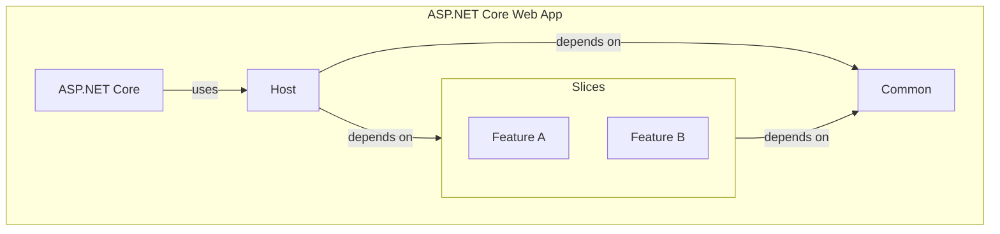

# SSW Vertical Slice Architecture Template

<div align="center">

[](https://youtube.com/@SSWTV)

[](https://github.com/SSWConsulting/SSW.VerticalSliceArchitecture/actions/workflows/package.yml)
[](https://github.com/SSWConsulting/SSW.VerticalSliceArchitecture/issues)

</div>

[comment]: <> (Table of contents generated with markdown-toc http://ecotrust-canada.github.io/markdown-toc/)
<!-- TOC -->
[SSW Vertical Slice Architecture Template](#ssw-vertical-slice-architecture-template)

* [🤔 What is it?](#---what-is-it-)
* [✨ Features](#--features)
* [🎉 Getting Started](#---getting-started)
* [🎓 Learn More](#---learn-more)
* [🚀 Publishing Template](#---publishing-template)
* [🤝 Contributing](#---contributing)

<!-- TOC -->

## 🤔 What is it?

An enterprise ready solution template for Vertical Slice Architecture.
This template is just one way to apply the Vertical Slice Architecture.

Read more on [SSW Rules to Better Vertical Slice Architecture](https://www.ssw.com.au/rules/rules-to-better-vertical-slice-architecture/)

## ✨ Features
- 🔨 `dotnet new` cli template - to get you started quickly
- 🚀 Aspire
    - Dashboard
    - Resource orchestration
    - Observability
    - Simple dev setup - automatic provisioning of database server, schema, and data
- 🎯 Domain Driven Design Patterns
    - AggregateRoot
    - Entity
    - ValueObject
    - DomainEvent
- ⚡ FastEndpoints - developer friendly alternative to Minimal APIs. 
    - Strongly-typed requests and responses
    - Automatic validation with FluentValidation
    - Support for commands and events
- 📝 OpenAPI/Swagger - easily document your API
    - as per [ssw.com.au/rules/do-you-document-your-webapi/](https://ssw.com.au/rules/do-you-document-your-webapi/)
- 🔑 Global Exception Handling - it's important to handle exceptions in a consistent way & protect sensitive information
    - Transforms exceptions into a consistent format following the [RFC7231 memo](https://datatracker.ietf.org/doc/html/rfc7231#section-6.1)
- 🗄️ Entity Framework Core - for data access
    - Comes with Migrations & Data Seeding
    - as per [ssw.com.au/rules/rules-to-better-entity-framework/](https://ssw.com.au/rules/rules-to-better-entity-framework/)
- 🧩 Specification Pattern - abstract EF Core away from your business logic
- 🔀 REPR (Request-Endpoint-Response) Pattern - for structured endpoints
- 📦 ErrorOr - fluent result pattern (instead of exceptions)
- 📦 FluentValidation - for validating requests
    - as per [ssw.com.au/rules/use-fluent-validation/](https://ssw.com.au/rules/use-fluent-validation/)
- 🆔 Strongly Typed IDs - to combat primitive obsession
    - e.g. pass `CustomerId` type into methods instead of `int`, or `Guid`
    - Entity Framework can automatically convert the int, Guid, nvarchar(..) to strongly typed ID.
- 📁 Directory.Build.Props
    - Consistent build configuration across all projects in the solution
        - e.g. Treating Warnings as Errors for Release builds
    - Custom per project
        - e.g. for all test projects we can ensure that the exact same versions of common packages are referenced
        - e.g. XUnit and NSubstitute packages for all test projects
- ⚖️ EditorConfig - comes with the [SSW.EditorConfig](https://github.com/SSWConsulting/SSW.EditorConfig)
    - Maintain consistent coding styles for individual developers or teams of developers working on the same project using different IDEs
    - as per [ssw.com.au/rules/consistent-code-style/](https://ssw.com.au/rules/consistent-code-style/)

- 🧪 Testing
    - as per [ssw.com.au/rules/rules-to-better-testing/](https://www.ssw.com.au/rules/rules-to-better-testing/)
    - Simpler Unit Tests for Application
        - **No Entity Framework mocking required** thanks to **Specifications**
        - as per [ssw.com.au/rules/rules-to-better-unit-tests/](https://www.ssw.com.au/rules/rules-to-better-unit-tests/)
    - Better Integration Tests
        - Using [Respawn](https://github.com/jbogard/Respawn) and [TestContainers](https://dotnet.testcontainers.org/)
        - Integration Tests at Unit Test speed
        - Test Commands and Queries against a Real database
        - No Entity Framework mocking required
        - No need for In-memory database provider
- Architecture Tests
    - Using [NetArchTest](https://github.com/BenMorris/NetArchTest)
    - Know that the team is following the same Vertical Slice Architecture fundamentals
    - The tests are automated so discovering the defects is fast

## 🎉 Getting Started

### Prerequisites

- [Docker](https://www.docker.com/get-started/) / [Podman](https://podman.io/get-started)
- [Dotnet 9](https://dotnet.microsoft.com/en-us/download/dotnet/9.0)

### Installing the Template

1. Install the SSW VSA template
   ```bash
   dotnet new install SSW.VerticalSliceArchitecture.Template
   ```

> NOTE: The template only needs to be installed once. Running this command again will update your version of the template.

2. Create a new directory
   ```bash
   mkdir Sprout
   cd Sprout
   ```

3. Create a new solution
   ```bash
   dotnet new ssw-vsa
   ```

> NOTE: `name` is optional; if you don't specify it, the directory name will be used as the solution name and project namespaces.

Alternatively, you can specify the `name` and `output` directory as follows:

```bash
dotnet new ssw-vsa --name {{SolutionName}}
```

### Running the Solution

1. Change directory
   Windows:
   ```ps
   cd tools\AppHost\
   ```
   Mac/Linux:
   ```bash
   cd tools/AppHost/
   ```

2. Run the solution
   ```bash
   dotnet run
   ```

> [!NOTE] The first time you run the solution, it may take a while to download the docker images, create the DB, and seed the data.

4. Open https://localhost:7255/swagger in your browser to see it running ️🏃‍♂️

## Adding Features

### Adding a Feature Slice

To speed up development there is a `dotnet new` template to create a full Vertical Slice:

- Creates a domain object in `Common/Domain/*`
- Adds domain configuration in `Common/Persistence/*`
- Creates Command & Query API endpoints in `Features/*`

1. Add a new Feature
   ```bash
   cd src/WebApi/
   dotnet new ssw-vsa-slice --feature Person --feature-plural People
   ```
    
`--feature` or `-f` where the value is the **singular** name of the feature.
`--feature-plural` or `-fp` where the value is the **plural** name of the feature.

2. Configure this Feature
   This project uses [strongly typed IDs](https://www.ssw.com.au/rules/do-you-use-strongly-typed-ids/), which require registration in the `VogenEfCoreConverters` class:
   ```csharp
   // Register the newly created Entity ID here
   [EfCoreConverter<PersonId>]
   internal sealed partial class VogenEfCoreConverters;
   ```

3. Add a migration for the new Entity
   ```bash
   dotnet ef migrations add --project src/WebApi/WebApi.csproj --startup-project src/WebApi/WebApi.csproj --output-dir Common/Database/Migrations PersonTable 
   ```

### EF Migrations
Due to .NET Aspire orchestrating the application startup and migration runner, EF migrations need to be handled a little differently to normal.

#### Adding a Migration
Adding new migrations is still the same old command you would expect, but with a couple of specific parameters to account for the separation of concerns. This can be performed via native dotnet tooling or through the Aspire CLI:

1. Run either of following commands from the root of the solution.

```bash
dotnet ef migrations add YourMigrationName --project ./src/Infrastructure/Infrastructure.csproj --startup-project ./src/WebApi/WebApi.csproj --output-dir ./Persistence/Migrations
```

```bash
aspire exec --resource api -- dotnet ef migrations add YourMigrationName --project ../Infrastructure/Infrastructure.csproj --output-dir ./Persistence/Migrations
```

#### Applying a Migration
.NET Aspire handles this for you - just start the project!

#### Removing a Migration
This is where things need to be done a little differently and requires the Aspire CLI.

1. Enable the `exec` function:

```bash
aspire config set features.execCommandEnabled true
```

2. Pass the EF migration shell command through Aspire from the root of the solution:

```bash
aspire exec --resource api -- dotnet ef migrations remove --project ..\Infrastructure --force
```
> [!NOTE]
> The `--force` flag is needed because .NET Aspire will start the application when this command is run, which triggers the migrations to run. This will apply your migrations to the database, and make EF Core unhappy when it tries to delete the latest migration. This should therefore be used with caution - a safer approach is to "roll forward" and create new migrations that safely undo the undesired change(s).

## Deploying to Azure

The template can be deployed to Azure via
the [Azure Developer CLI (AZD)](https://learn.microsoft.com/en-us/azure/developer/azure-developer-cli/install-azd?tabs=winget-windows,brew-mac,script-linux&pivots=os-mac).
This will setup the following:

- Azure App Services: API + MigrationService
- Azure SQL Server + Database: Data storage
- Application Insights + Log Analytics: For monitoring and logging
- Managed Identities: For secure access to Azure resources
- Azure Container Registry: For storing Docker images

### Steps to Deploy

1. Authenticate with Azure

    ```bash
    azd auth login
    ```

2. Initialize AZD for the project

    ```bash
    azd init
    ```

3. Update environment variables

    ```bash
    azd env set ASPNETCORE_ENVIRONMENT Development
    ```

4. Deploy to Azure

    ```bash
    azd up
    ```

> [!NOTE]
> `azd up` combines `azd provision` and `azd deploy` commands to create the resources and deploy the application. If running this from a CI/CD
> pipeline, you can use `azd provision` and `azd deploy` separately in the appropriate places.


## 🎓 Learn More

[](https://www.youtube.com/watch?v=T-EwN9UqRwE) [](http://lukeparker.dev/blog/vertical-slice-architecture-quick-start)

[
](https://www.youtube.com/watch?v=T-EwN9UqRwE)



## 🚀 Publishing Template

Template will be published to NuGet.org when changes are made to `VerticalSliceArchitecture.nuspec` on the `main` branch.

### Process

1. Update the `version` attribute in `VerticalSliceArchitecture.nuspec`
2. Merge your PR
3. `package` GitHub Action will run and publish the new version to NuGet.org
4. Create a GitHub release to document the changes

> [!NOTE] We are now using CalVer for versioning. The version number should be in the format `YYYY.M.D` (e.g. `2024.2.12`).

## 🤝 Contributing

Contributions, issues and feature requests are welcome! See [Contributing](./CONTRIBUTING.md) for more information.
