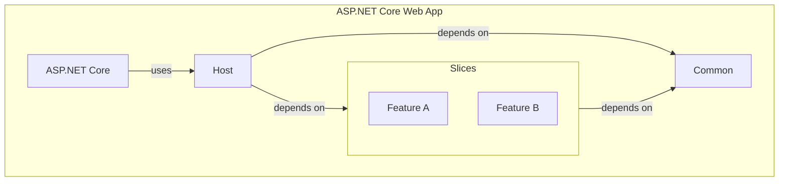

# SSW Vertical Slice Architecture Template

<div align="center">

[](https://youtube.com/@SSWTV)

[](https://github.com/SSWConsulting/SSW.VerticalSliceArchitecture/actions/workflows/package.yml)
[](https://github.com/SSWConsulting/SSW.VerticalSliceArchitecture/issues)

</div>

[comment]: <> (Table of contents generated with markdown-toc http://ecotrust-canada.github.io/markdown-toc/)
<!-- TOC -->
[SSW Vertical Slice Architecture Template](#ssw-vertical-slice-architecture-template)

* [🤔 What is it?](#---what-is-it-)
* [✨ Features](#--features)
* [🎉 Getting Started](#---getting-started)
* [🎓 Learn More](#---learn-more)
* [🚀 Publishing Template](#---publishing-template)
* [🤝 Contributing](#---contributing)

<!-- TOC -->

## 🤔 What is it?

An enterprise ready solution template for Vertical Slice Architecture.
This template is just one way to apply the Vertical Slice Architecture.

Read more on [SSW Rules to Better Vertical Slice Architecture](https://www.ssw.com.au/rules/rules-to-better-vertical-slice-architecture/)

## ✨ Features
- 🔨 `dotnet new` cli template - to get you started quickly
- 🤖 Agent skills - the conventions are executable, not just documented
    - `/add-entity` and `/add-slice` ship in `.claude/skills/`
    - Scaffolds the whole slice, including the strongly typed ID registration that's a startup failure when missed
- 🚀 Aspire
    - Dashboard
    - Resource orchestration
    - Observability
    - Simple dev setup - automatic provisioning of database server, schema, and data
- 🎯 Domain Driven Design Patterns
    - AggregateRoot
    - Entity
    - ValueObject
    - DomainEvent
- ⚡ FastEndpoints - developer friendly alternative to Minimal APIs. 
    - Strongly-typed requests and responses
    - Automatic validation with FluentValidation
    - Support for commands and events
- 📝 OpenAPI/Swagger - easily document your API
    - as per [ssw.com.au/rules/do-you-document-your-webapi/](https://ssw.com.au/rules/do-you-document-your-webapi/)
- 🔑 Global Exception Handling - it's important to handle exceptions in a consistent way & protect sensitive information
    - Transforms exceptions into a consistent format following the [RFC7231 memo](https://datatracker.ietf.org/doc/html/rfc7231#section-6.1)
- 🗄️ Entity Framework Core - for data access
    - Comes with Migrations & Data Seeding
    - as per [ssw.com.au/rules/rules-to-better-entity-framework/](https://ssw.com.au/rules/rules-to-better-entity-framework/)
- 🧩 Specification Pattern - abstract EF Core away from your business logic
- 🔀 REPR (Request-Endpoint-Response) Pattern - for structured endpoints
- 📦 ErrorOr - fluent result pattern (instead of exceptions)
- 📦 FluentValidation - for validating requests
    - as per [ssw.com.au/rules/use-fluent-validation/](https://ssw.com.au/rules/use-fluent-validation/)
- 🆔 Strongly Typed IDs - to combat primitive obsession
    - e.g. pass `CustomerId` type into methods instead of `int`, or `Guid`
    - Entity Framework can automatically convert the int, Guid, nvarchar(..) to strongly typed ID.
- 📁 Directory.Build.Props
    - Consistent build configuration across all projects in the solution
        - e.g. Treating Warnings as Errors for Release builds
    - Custom per project
        - e.g. for all test projects we can ensure that the exact same versions of common packages are referenced
        - e.g. XUnit and NSubstitute packages for all test projects
- ⚖️ EditorConfig - comes with the [SSW.EditorConfig](https://github.com/SSWConsulting/SSW.EditorConfig)
    - Maintain consistent coding styles for individual developers or teams of developers working on the same project using different IDEs
    - as per [ssw.com.au/rules/consistent-code-style/](https://ssw.com.au/rules/consistent-code-style/)

- 🧪 Testing
    - as per [ssw.com.au/rules/rules-to-better-testing/](https://www.ssw.com.au/rules/rules-to-better-testing/)
    - Simpler Unit Tests for Application
        - **No Entity Framework mocking required** thanks to **Specifications**
        - as per [ssw.com.au/rules/rules-to-better-unit-tests/](https://www.ssw.com.au/rules/rules-to-better-unit-tests/)
    - Better Integration Tests
        - Using [Respawn](https://github.com/jbogard/Respawn) and [TestContainers](https://dotnet.testcontainers.org/)
        - Integration Tests at Unit Test speed
        - Test Commands and Queries against a Real database
        - No Entity Framework mocking required
        - No need for In-memory database provider
- Architecture Tests
    - Using [NetArchTest](https://github.com/BenMorris/NetArchTest)
    - Know that the team is following the same Vertical Slice Architecture fundamentals
    - The tests are automated so discovering the defects is fast

## 🎉 Getting Started

### Prerequisites

- [Docker](https://www.docker.com/get-started/) / [Podman](https://podman.io/get-started) / [OrbStack](https://orbstack.dev/)
- [.NET 10 SDK](https://dotnet.microsoft.com/en-us/download/dotnet/10.0)
- [Aspire CLI](https://aspire.dev/get-started/install-cli/)
- `dotnet-ef`, restored from the solution's tool manifest:
  ```bash
  dotnet tool restore
  ```
  The AppHost's `migrations` resource shells out to `dotnet ef database update` on every start,
  so the app won't boot without it. `.config/dotnet-tools.json` pins the version that matches the
  solution's EF Core packages — a mismatched global `dotnet-ef` will not do.

### Installing the Template

1. Install the SSW VSA template
   ```bash
   dotnet new install SSW.VerticalSliceArchitecture.Template
   ```

> [!NOTE] 
> The template only needs to be installed once. Running this command again will update your version of the template.

2. Create a new directory
   ```bash
   mkdir Sprout
   cd Sprout
   ```

3. Create a new solution
   ```bash
   dotnet new ssw-vsa
   ```

> [!NOTE]
> `name` is optional; if you don't specify it, the directory name will be used as the solution name and project namespaces.

Alternatively, you can specify the `name` and `output` directory as follows:

```bash
dotnet new ssw-vsa --name {{SolutionName}}
```

### Running the Solution

1. Restore the local tools (first run only)
   ```bash
   dotnet tool restore
   ```

2. Run the solution
   ```bash
   aspire start
   ```

> [!NOTE]
> The first time you run the solution, it may take a while to download the docker images, create the DB, and seed the data.

2. Open https://localhost:7255/swagger in your browser to see it running ️🏃‍♂️

## Adding Features

### Adding a Feature Slice

A full Vertical Slice is a set of files across the domain, persistence, and feature layers:

- A domain object in `src/WebApi/Common/Domain/*`
- Domain configuration in `src/WebApi/Common/Persistence/*`
- Command & Query API endpoints in `src/WebApi/Features/*`

The template ships skills that scaffold all of this for you. In Claude Code:

```
/add-entity   # domain object, strongly typed ID, spec, EF config, DbSet, Vogen registration, migration
/add-slice    # one use case — endpoint, request, response, validator, summary — plus tests
```

Run `/add-entity` first when the use case needs a domain type that doesn't exist yet, then `/add-slice`. The skills live in `.claude/skills/`, and the conventions they follow are documented in [`CLAUDE.md`](CLAUDE.md) and `.claude/rules/`. Using a different agent? Point it at `.claude/skills/add-slice/SKILL.md` — they're plain markdown.

`/add-slice` adds a *slice* — one use case in its own folder. It creates the Feature and its route Group as well, but only when the slice is the first one in that Feature. [`CONTEXT.md`](CONTEXT.md) defines both terms.

To do it by hand instead, copy an existing feature such as `Heroes` and rename it. Two steps are easy to miss:

1. Register the strongly typed ID
   This project uses [strongly typed IDs](https://www.ssw.com.au/rules/do-you-use-strongly-typed-ids/), which require registration in the `VogenEfCoreConverters` class. Miss this and the app throws on startup — it isn't a compile error:
   ```csharp
   // Register the newly created Entity ID here
   [EfCoreConverter<PersonId>]
   internal sealed partial class VogenEfCoreConverters;
   ```

2. Add a migration for the new Entity
   ```bash
   dotnet ef migrations add AddPerson --project src/WebApi/WebApi.csproj --startup-project src/WebApi/WebApi.csproj --output-dir Common/Persistence/Migrations
   ```

### EF Migrations

Migrations are their own Aspire resource. The AppHost declares it with
`AddEFMigrations("migrations")`, and `RunDatabaseUpdateOnStart()` runs
`dotnet ef database update` before the API starts. Both the migrations and the `ApplicationDbContext`
live in `src/WebApi`, so every command below targets that one project.

#### Adding a Migration

```bash
dotnet ef migrations add YourMigrationName --project src/WebApi/WebApi.csproj --startup-project src/WebApi/WebApi.csproj --output-dir Common/Persistence/Migrations
```

#### Applying a Migration

Locally, .NET Aspire handles this for you — just start the project. The `migrations` resource
runs to completion, then the `seeder` and `api` resources start. Watch its progress in the
Aspire Dashboard like any other resource.

On Azure this is a deployment step rather than something the app does to itself — see
[Deploying to Azure](#deploying-to-azure).

#### Removing a Migration

```bash
dotnet ef migrations remove --project src/WebApi/WebApi.csproj --startup-project src/WebApi/WebApi.csproj
```

No `--force` and no `aspire exec`: the app no longer has to be running for this. Removing a
migration that has already been applied to your local database still fails, which is EF Core
protecting you rather than a quirk of the orchestration. Either drop the local database first
(the **Drop Database** command on the `AppDb` resource in the dashboard) or roll forward with a
new migration that undoes the change — rolling forward is the safer habit once a migration has
left your machine.

## Deploying to Azure

The template can be deployed to Azure via
the [Azure Developer CLI (AZD)](https://learn.microsoft.com/en-us/azure/developer/azure-developer-cli/install-azd?tabs=winget-windows,brew-mac,script-linux&pivots=os-mac).
This will setup the following:

- Azure App Service: API
- Azure SQL Server + Database: Data storage
- Application Insights + Log Analytics: For monitoring and logging
- Managed Identities: For secure access to Azure resources
- Azure Container Registry: For storing Docker images

The `seeder` resource is deliberately absent. It's only added to the graph in run mode, so it
never reaches Azure and Bogus data can't land in a deployed database.

### Steps to Deploy

1. Authenticate with Azure

    ```bash
    azd auth login
    ```

2. Initialize AZD for the project

    ```bash
    azd init
    ```

3. Deploy to Azure

    ```bash
    azd up
    ```

> [!NOTE]
> `azd up` combines `azd provision` and `azd deploy` commands to create the resources and deploy the application. If running this from a CI/CD
> pipeline, you can use `azd provision` and `azd deploy` separately in the appropriate places.

### Applying Migrations on Azure

**`azd up` does not apply migrations.** `PublishAsMigrationBundle()` writes an artifact; it
doesn't run one. Applying it is a step you own.

Publishing produces a self-contained [EF Core migration bundle](https://learn.microsoft.com/en-us/ef/core/managing-schemas/migrations/applying#bundles)
at `efmigrations/migrations` in the output directory. Run it against the target database as a
deployment step, after `azd provision` and before (or alongside) `azd deploy`:

```bash
aspire publish --output-path ./publish
./publish/efmigrations/migrations --connection "<target-connection-string>"
```

> [!IMPORTANT]
> The bundle is a native executable built for the platform that published it. Publishing on a
> macOS or Windows dev box produces a binary that will not run on a Linux CI agent. Generate it
> on a runner matching wherever you intend to execute it.

Two alternatives, depending on how your organisation prefers to ship schema changes:

- `PublishAsMigrationScript()` in place of `PublishAsMigrationBundle()` emits an idempotent
  `.sql` script instead of a binary. It has no platform problem and it's reviewable before it
  runs, which many DBA-gated environments require.
- `PublishAsAzureContainerAppJob()` is the one option that applies migrations automatically on
  deploy, but it needs Azure Container Apps. This template targets App Service, so it isn't
  wired up here.


## 🎓 Learn More

[](https://www.youtube.com/watch?v=T-EwN9UqRwE) [](http://lukeparker.dev/blog/vertical-slice-architecture-quick-start)

[
](https://www.youtube.com/watch?v=T-EwN9UqRwE)


```mermaid
graph TD;
    subgraph ASP.NET Core Web App
        subgraph Slices
            A[Feature A]
            B[Feature B]
        end
        Slices --> |depends on| Common
        Host --> |depends on| Common
        Host --> |depends on| Slices
        ASPNETCore[ASP.NET Core] --> |uses| Host
    end

    Common[Common]
```

## 🚀 Publishing Template

Template will be published to NuGet.org when changes are made to `VerticalSliceArchitecture.nuspec` on the `main` branch.

### Process

1. Update the `version` attribute in `VerticalSliceArchitecture.nuspec`
2. Merge your PR
3. `package` GitHub Action will run and publish the new version to NuGet.org
4. Create a GitHub release to document the changes

> [!NOTE]
> We are now using CalVer for versioning. The version number should be in the format `YYYY.M.D` (e.g. `2024.2.12`).

## 🤝 Contributing

Contributions, issues and feature requests are welcome! See [Contributing](./CONTRIBUTING.md) for more information.
